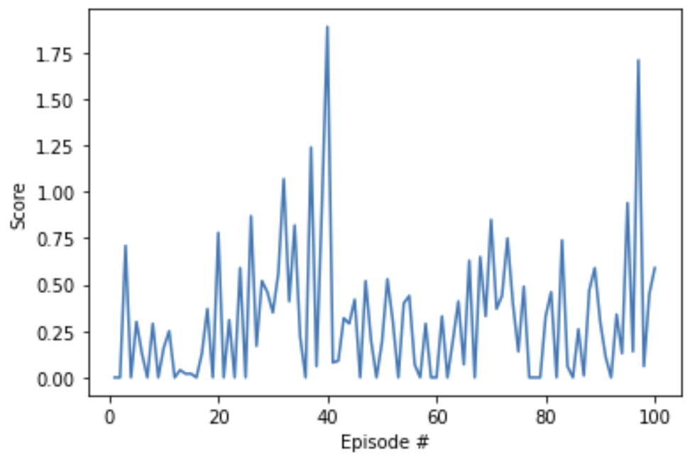
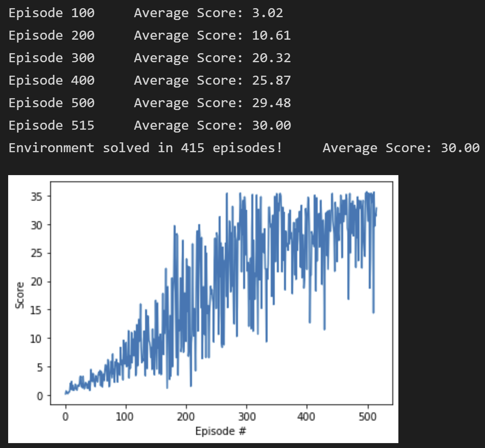

# Project 2: Continuous Control

## Description of the implementation
This implementation tackles the first version of the environment which consists of a single agent.

### Algorithm
The base reinforcement learning algorithm implemented to solve the continuous control challenge for this Reacher environment is based on [DDPG](https://arxiv.org/abs/1509.02971). Intuitively, DDPG is an extension of DQN for continuous action space. It has an Actor network which tries to learn the best action given an input state of the environment and a Critic network which tries to learn an optimal action-value function based on the input state and the best action predicted by the Actor network.

### Hyperparameters
The hyperaparameters were intially adapted from the [DDPG agent solution](https://github.com/udacity/deep-reinforcement-learning/tree/master/ddpg-pendulum) on the OpenAI Gym's Pendulum environment. Main hyperparameters that were empirically modified were the maximum length of each episode (max_t), learning rates of both networks and sigma value of OUNoise.

#### Initial Parameters
- max_t: 300
- BATCH_SIZE: 128
- LR_ACTOR: 10^-3
- LR_CRITIC: 10^-3
- GAMMA: 0.99
- TAU: 10^-3
- OUNoise sigma: 0.2

#### Final Parameters
- max_t: 900
- BATCH_SIZE: 128
- LR_ACTOR: 3x10^-4
- LR_CRITIC: 3x10^-4
- GAMMA: 0.99
- TAU: 10^-3
- OUNoise sigma: 0.1

### Network Architecture
The initial network architectures were adapted from the [DDPG agent solution](https://github.com/udacity/deep-reinforcement-learning/tree/master/ddpg-pendulum) on the OpenAI Gym's Pendulum environment. The sizes of layers were then empirically modified alongwith adding a batch normalization layer after the first ReLu activation layer for both Actor and Critic networks.   

#### Initial Architecture
- Actor network: 2 fully connected layers of sizes 400 and 300 respectively
- Critic network: 2 fully connected layers of sizes 400 and 300 respectively

#### Final Architecture
- Actor network: 2 fully connected layers of sizes 256 and 128 respectively
- Critic network: 2 fully connected layers of sizes 256 and 128 respectively
- Batch normalization layer after the first fully connected layer

### Improvement
The above mentioned hyperparameters and network architectures were empirically modified by looking at the score graphs for first 100 episodes for each combinaion of values. In addition, gradient clipping was applied for training the critic network as suggested in the benchmark implementation as shown in the image below. Eventually, the environment was solved in 415 episodes.

## Plot of Rewards

### Initial Architecture and Hyperparameters

### Final Architecture and Hyperparameters

## Ideas for Future Work

- Further finetuning of the hyperparameters and architecture can be explored to make the learning faster as well as more stable.
- [Prioritized experience replay for DDPG](https://ieeexplore.ieee.org/document/8122622) can be utilized which is claimed to reduce the training time, improve training stabilty and decrease sensitivity to hyperparameters.
- [PPO](https://arxiv.org/pdf/1707.06347.pdf) or [A3C](https://arxiv.org/pdf/1602.01783.pdf) that use multiple (non-interacting, parallel) copies of the same agent for gathering experience can potentially be implemented for the second version of the environment which may speed up the learning process.